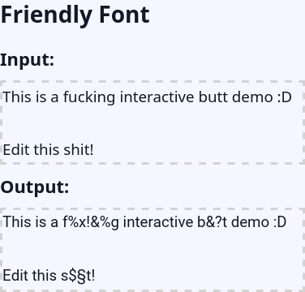
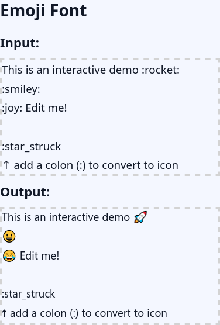
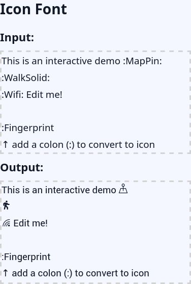

# Feature-Fonts

On this repository we release some of our fun font experiments using OpenType Font-Features.

Fonts are no serious issue, use them as a playground for your creativity!

[Demos](https://born2root.github.io/Feature-Fonts)

---

## Friendly Font

[README](./friendly_font/README.md)

---

## Emoji Font

[README](./emoji_font/README.md)

---

## Icon Font

[README](./icon_font/README.md)

---

## Support:

The fonts stored in this repository are provided free of charge.
If you like the project, we would appreciate your support.

---

## Useful Links:

Visit our other Font-Project with focus on speed reading:
https://github.com/Born2Root/Fast-Font/
